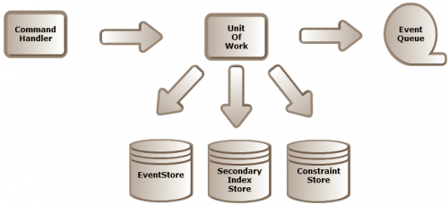

Anyone who has been following the [ddd/cqrs](groups.google.com/group/dddcqrs) mailing list and has read Greg's article on [Eventual Consistency and Set Validation](http://codebetter.com/blogs/gregyoung/archive/2010/08/12/eventual-consistency-and-set-validation.aspx "Eventual Consistency and Set Validation") will have wondered how to create immediately consistent secondary indexes and enforce uniqueness constraints. Despite the fact that immediate consistency hurts scalability, I don't see any harm in discussing on how to achieve it. After all, you might be highly collaborative, but not need to scale to that level.  Let's step back for a moment. What are we trying to achieve with a secondary index? Suppose in my command handler I want to be able to query on something else than the aggregate's unique identifier (an alternate identifier, a set of aggregates that are contained by a parent aggregate, etc...). That's what the secondary index store is for - you don't have a regular queryable schema when using an event store. What are we trying to achieve with a constraint? Well, the most obvious case is the uniqueness of a certain trait of an aggregate within a set of aggregates (the classical case being the uniqueness of a login name of a user account). So, now that we have the "what"/"why" out of the way let's see about the "how".

> NOTICE: Please note that what I'm about to discuss are immediately consistent secondary indexes and constraints (in the context of an RDBMS). Only use these as a last resort. Read Greg's [article](http://codebetter.com/blogs/gregyoung/archive/2010/08/12/eventual-consistency-and-set-validation.aspx) before you go down this path.

Remember how I mentioned the interesting part was the event handler. The idea is to have event handlers that maintain the secondary index and constraint store, and plug them into the commit of the UoW (Unit of work) or the flush of the Repository. Basically these event handlers do the same job as a read model's denormalizer: insert/update/delete data into/in/from a table. Below you'll find a sample schema of the tables involved (I call them "store", but in an RDBMS they are just a single table). **SetConstraint***table*

-   ConstraintCode: int - Identifies the constraint
-   AggregateId: Guid - Identifies the aggregate that provides the hash value
-   Hash: byte\[\] - Hashed value of one or more traits that make up the constraint

REMARK: Putting an RDBMS uniqueness constraint on ConstraintCode and Hash makes sure the constraint gets enforced. **SetSecondaryIndex***table*

-   SecondaryIndexCode: int - Identifies the secondary index
-   AggregateId: Guid - Identifies the aggregate that provides the hash value and that will be returned when querying the index
-   Hash: byte\[\] - Hash value of one or more traits that make up the index

REMARK: There's no RDBMS uniqueness constraint here because recurring hash values are just fine. It just means that more aggregates meet the same criteria. Below is some sample code to illustrate how everything fits together. 

```csharp
 // Command infrastructure public interface ICommand {} public interface ICommandHandler&lt;TCommand&gt; where TCommand : ICommand { void Handle(TCommand command); } // Command to create a user account - very contrived command I might add public class CreateUserAccountCommand : ICommand { public Guid UniqueId { get; set; } public string Login { get; set; } } // Allows for adding new UserAccount aggregates and flushing them to the event store. public interface IUserAccountRepository { void Add(UserAccount account); void Flush(); // I'm deliberately omitting a UOW approach here for brevity } // Handles the "create a user account" command public class CreateUserAccountCommandHandler : ICommandHandler&lt;CreateUserAccountCommand&gt; { private IUserAccountRepository \_repository; public CreateUserAccountCommandHandler(IUserAccountRepository repository) { \_repository = repository; } public void Handle(CreateUserAccountCommand command) { try { \_repository.Add(UserAccount.New(command.UniqueId, command.Login)); \_repository.Flush(); } catch(UniquenessConstraintViolationException&lt;ConstraintCode&gt; exception) { // Converts the uniqueness constraint violation into something // the consuming layer will understand. exception. ThrowIf( ConstraintCode.Login, CreateUserAccountCommandErrorCode.LoginNotUnique). Throw(); } } } // Event infrastructure public interface IEvent {} public interface IEventHandler&lt;TEvent&gt; where TEvent : IEvent { void Handle(TEvent @event); } // Domain - More info on how event sourcing works can be found @ // http://github.com/gregoryyoung/m-r public class UserAccount : Aggregate { private UserAccount(IEvent @event) { ApplyEvent(@event); } public static UserAccount New(Guid id, string login) { return new UserAccount(new UserAccountCreatedEvent(id, login)); } } // Event representing the fact that a user account was created public class UserAccountCreatedEvent : IEvent { public Guid Id { get; private set; public string Login { get; private set; } public UserAccountCreatedEvent(Guid id, string login) { Id = id; Login = login; } } // Hashing infrastructure - Creates a hash based on one or more typed values public interface IHashCreator { byte\[\] Hash&lt;T&gt;(T value); byte\[\] Hash&lt;T1, T2&gt;(T1 value1, T2 value2); byte\[\] Hash&lt;T1, T2, T3&gt;(T1 value1, T2 value2, T3 value3); // More hash func overloads go here ... } // Constraint infrastructure - Set of operations that allow to maintain a constraint // The implementation is - fairly boring - plain old ADO.NET code. public interface ISetConstraintOperations&lt;TSetConstraintCode&gt; where TSetConstraintCode : IConvertible { // Throws a UniquenessConstraintViolationException&lt;TSetConstraintCode&gt; // when the underlying RDBMS throws a uniqueness violation constraint void InsertIntoSet(TSetConstraintCode setConstraintCode, Guid aggregateId, byte\[\] hash); void DeleteFromSet(TSetConstraintCode setConstraintCode, Guid aggregateId); void UpdateInSet(TSetConstraintCode setConstraintCode, Guid aggregateId, byte\[\] hash); } // Domain specific constraints public enum ConstraintCode { Login = 1 } // Enforces uniqueness constraints by intercepting events // Called by the repository's Flush public class EnforceConstraintsEventHandler : IEventHandler&lt;UserAccountCreatedEvent&gt; { private IHashCreator \_hashCreator; private ISetConstraintOperations&lt;ConstraintCode&gt; \_operations; public EnforceConstraintsEventHandler( IHashCreator hashCreator, ISetConstraintOperations&lt;ConstraintCode&gt; operations) { \_hashCreator = hashCreator; \_operations = operations; } public void Handle(UserAccountCreatedEvent @event) { \_operations.InsertIntoSet( ConstraintCode.Login, @event.Id, \_hashCreator.Hash(@event.Login)); } } // Index infrastructure - Set of operations that allow to maintain a secondary index // The implementation is - fairly boring - plain old ADO.NET code. public interface ISetSecondaryIndexOperations&lt;TSetSecondaryIndexCode&gt; where TSetSecondaryIndexCode : IConvertible { void InsertIntoSet(TSetSecondaryIndexCode setSecondaryIndexCode, Guid aggregateId, byte\[\] hash); void DeleteFromSet(TSetSecondaryIndexCode setSecondaryIndexCode, Guid aggregateId); void UpdateInSet(TSetSecondaryIndexCode setSecondaryIndexCode, Guid aggregateId, byte\[\] hash); } // Domain specific indexes public enum SecondaryIndexCode { Login = 1 } // Maintains the secondary index by intercepting events // Called by the repository's Flush public class MaintainIndexesEventHandler : IEventHandler&lt;UserAccountCreatedEvent&gt; { private IHashCreator \_hashCreator; private ISetSecondaryIndexOperations&lt;SecondaryIndexCode&gt; \_operations; public MaintainIndexesEventHandler( IHashCreator hashCreator, ISetSecondaryIndexOperations&lt;SecondaryIndexCode&gt; operations) { \_hashCreator = hashCreator; \_operations = operations; } public void Handle(UserAccountCreatedEvent @event) { \_operations.InsertIntoSet( SecondaryIndexCode.Login, @event.Id, \_hashCreator.Hash(@event.Login)); } } 
```

 As you can see all the logic is encapsulated by the event handlers, just handling events as a read model would do. What would change if you'd want to make this eventually consistent? Mainly the place where the event handlers are hosted: outside of the transaction, as yet another consumer of events. The EnforceConstraintsEventHandler would need to catch any violations and issue appropriate compensating commands or do whatever the business wants you to do in such a case. One-way commands would require the same change (i.e. having the command handler handle the violation would be no good). I'm sure I left plenty of holes for you to fill, but I do hope you surf away with a more thorough understanding of how to tackle this problem.
