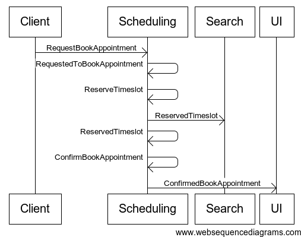

The other day, while commenting on my EventBuilders post, [Thorsten Krüger](http://twitter.com/ThoKrue) questioned how one would keep an overview of all the messages (commands, events) floating around the system in a meaningful way. Anybody who has built larger messaging systems (or parts thereof), or used messaging to integrate with other systems, will acknowledge that some form of contract/protocol negotiation has taken place, such that all parties can communicate with one another. At times, on the surface of it, it might look like nothing more than a form of data-exchange. But if you question why that data goes to and fro, usually there'll be some greater goal, a business function that data supports. Other times it might really be behavior going over the wire, in the form of serialized messages that want your end or their end to mutate state and reply or publish upon completion (success/failure). Nevertheless, as the title of this post suggests, visual documentation is what will keep the bigger picture clear. At a high level, visual documentation of communication between bounded contexts will function somewhat like a context map, but it's more focused on the command/event interactions supporting a specific use case/user story/business function. Mind you that this way of documenting your system's interactions is not limited to communication between bounded contexts. It could as well be breaking down a process that affects multiple aggregates, tied together by a saga or several eventhandlers triggering one command after another. The most useful tool I've found to document the flow of messages is by far [interaction diagrams](http://en.wikipedia.org/wiki/Interaction_diagram#Interaction_diagrams "Interaction diagrams"), and more specifically [sequence diagrams](http://en.wikipedia.org/wiki/Sequence_diagrams "Sequence diagrams"). Below you'll find an example using the excellent <http://www.websequencediagrams.com/> (seriously, try it and if you like it, consider buying it). 
