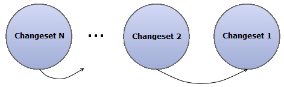
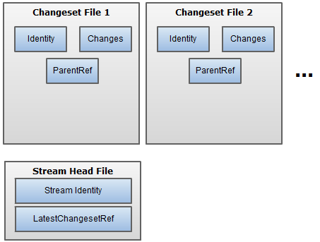
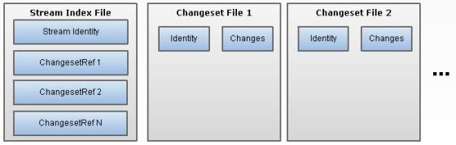
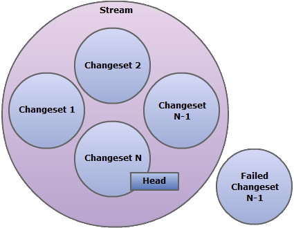

A week ago I had an interesting twonversation with [Jérémie Chassaing](http://thinkbeforecoding.com/ "Jérémie Chassaing") and [Rinat Abdullin](http://abdullin.com/ "Rinat Abdullin") about [event streams](http://abdullin.com/journal/2011/12/3/thoughts-on-event-streams-in-elastic-environments.html "event streams ala Rinat"). I mentioned how I had been toying with eventstreams as being linked lists of changesets (to the aficionados of [Jonathan Oliver's](http://blog.jonathanoliver.com "Jonathan Oliver's blog")[EventStore](https://github.com/joliver/EventStore "The EventStore Project @ GitHub"), this is very much akin to what he calls [Commits](http://blog.jonathanoliver.com/2010/12/cqrs-eventstore-v2-architectural-overview/ "Commits explained")) in the past. As a way of documenting some of my thoughts on the subject I'm putting up some schematics here. \[caption id="attachment\_304" align="aligncenter" width="329" caption="Model"\]\[/caption\] Each changeset knows its "parent", i.e. the changeset that it should be appended to. Except for the very first changeset, which obviously does not have a "parent" (strictly speaking you could have an explicit terminator "parent"). Chronologically, changeset 1 came before changeset 2, changeset 2 came before changeset 3, and so on. Looking at the write side of a system that uses event streams for storage, there are two main scenarios:

1.  Writing a changeset of a given event stream: concerns here are duplicate changeset elimination & detecting conflicts, besides the act of actually writing.
2.  Reading the entire event stream: the main concern here is reading all changesets of the event stream as fast as we can, in order.

> I'm well aware I've omitted other concerns such as automatic event upgrading, event dispatching, snapshotting which, frankly, are distractions at this point.

#### Reading

 Supposing that each changeset is say a file on disk, how would I know where to start reading? Various options, really. The picture above illustrates one option where - by using "&lt;streamid&gt;.txt" as a convention - the *Stream Head File* is loaded to bootstrap "walking the chain", by virtue of having it point to the latest changeset document (represented as *LatestChangesetRef*) that makes up that stream. As each *Changeset File* is read, it provides a reference/pointer to the next *Changeset File* to read (represented by *ParentRef*). That reference is really the identity of the next changeset.

> I hope I don't need to explain why you need to keep those identifiers logical. Don't make it a "physical" thing, like the path to the next changeset file. That would be really painful if you were ever to restructure the changeset files on disk. Instead you should delegate the responsibility of translating/resolving a logical identity into its physical location.

Other options for "*where to start reading*" could be:

1.  keeping the head of each stream in memory (causing "sticky" streams and dealing with recovery mechanisms).
2.  storing the head as a record in a database or blob storage with concurrency control
3.  ...

Now, reading each changeset file could become a bit costly if they're scattered allover the disk. There's nothing stopping you from throwing all those changeset documents in one big file, even **asynchronously**. This is where immutability and resolving identities can really help you out. It's important to distinguish between what happens at the logical level and what happens at the physical level.  Yet another approach might be to keep an index file of all changesets (above represented by the Stream Index File) that make up the event stream (in an append only fashion), thus alleviating the changeset documents from having to know their parents.

#### Writing

Basically, this operation can be split up into writing the changeset document and updating the head (or index) of the event stream. The advantage here is that storing the changeset document does not require any form of transaction. This allows you to choose from a broader range of data-stores as there really isn't a requirement beyond the guarantee that they will remember and serve what you asked them to store. Updating the head of the event stream does require you to at least be able to detect concurrent writes are happening or have happened, depending on how you want to resolve conflicts. As such, there's no need to store both of them in the same data-store. Also notice that the duration of the transaction is reduced by taking the changeset itself out of the equation.

> When picking a changeset identity, you might be tempted to reuse the identifier of the message that caused the changes to happen (usually the Command's message identifier). Don't. Remember, retrying that same command might produce a different set of changes. How are you going to differentiate between rectifying a previous failure with a retry and some other thread trying to process the same message? It's best to use identities/identifiers for just one purpose.

\[caption id="attachment\_331" align="aligncenter" width="425" caption="Model - Failure"\]\[/caption\] What happens when you can't update the head to your newly inserted changeset identity? You'll be left with a dangling changeset that didn't make it into "the circle of trust". No harm done, except for wasting some storage. If the changesets were blobs in the cloud it might be useful to have a special purpose daemon to hunt these down and remove them (depends on how much storage costs vs the cost of building the daemon) . In general you should optimize for having as few "concurrency conflicts" as possible (it's bad for business).

#### Conclusion

I know there are a lot of holes in this story. That's intentional, I have a lot of unanswered questions myself. I'm especially interested in any comments that can point me to prior art outside the realm of sourcecontrol systems. I have no intention of using this in production. It's just a mental exercise.

#### Acknowledgements

Most of what I mention here exists in one shape or another. By now some of you will have noticed the resemblance to certain aspects of Git's internal object model, although I'm inclined to say it's closer to what Mercurial does. The convention based file storage, can be found in the [NoDB](https://github.com/lucisferre/ncqrs/tree/master/Framework/src/Ncqrs/Eventing/Storage/NoDB "NoDB implementation in NCQRS @ GitHub") implementation by [Chris Nicola](http://lucisferre.net/ "Chris Nicola's blog"). Concepts such as commits and event streams (and much more) can be found in the [EventStore](https://github.com/joliver/EventStore "The EventStore Project @ GitHub") project.
