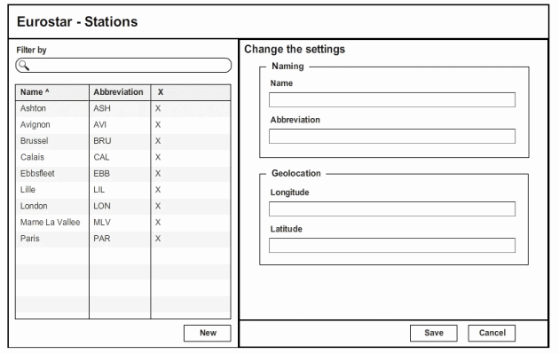

Although a lot has been written on the topic of *viewmodels* - both in the MVVM(\*) and MVC UI pattern space - it strikes me as odd how underused they are. Why muck around with resource files and attribute based validation hints inside your views when you could provide them with a rich viewmodel? Most people tend to think about their viewmodels in terms of *input*, either directly (e.g. the value of a textbox) or indirectly (e.g. one of the values you choose from a select, or a list from which to select a row). Why isn't *output* equally as important? Why are those magic strings in the view not part of the viewmodel? Why don't people question the implicit routing and navigation that goes into their views?

> Not including output in a view model and [primitive obsession](http://jamesshore.com/Blog/PrimitiveObsession.html "Primitive obsession") are the main reasons why logic and other dependencies creep into your view.

Let's take the screen of my post on [statecharts](http://seabites.wordpress.com/2011/12/08/your-ui-is-a-statechart/ "Your UI is a statechart") as an example.

 What most people end up with - if they even put in the effort to craft an explicit view model - is something along these lines. 

```csharp
 public class TrainStationModel { public string FilteredBy { get; set; } public List TrainStations { get; set; } public TrainStationDetails SelectedTrainStation { get; set; } } public class TrainStationItem { public Guid TrainStationId { get; set; } public string Name { get; set; } public string Abbreviation { get; set; } } public class TrainStationDetails { public Guid TrainStationId { get; set; } \[Required, StringLength(80, MinLength = 1)\] public string Name { get; set; } \[Required, StringLength(40, MinLength = 1)\] public string Abbreviation { get; set; } \[Required, Range(0,360)\] public double Longitude { get; set; } \[Required, Range(0,360)\] public double Latitude { get; set; } } 
```


If we'd want to I18N this screen it would require either a view per culture or a culture+resource aware view. For client-side validation it requires reflective helpers to get the meta-data, sprinkled as attributes on those model properties. Routing and navigation creep into the view as behaviors need to be executed.

Contrast this with what I've been using as viewmodels - below - for the past 7 years.


```csharp
 public class TrainStationAdministrationModel : Page { readonly TextOutputField \_header; readonly TrainStationBodyModel \_body; public TrainStationAdministrationModel() : base("trainstationadministration") { \_header = new TextOutputField("header", new Text(new StringResource("EurostarStationsKey"))); \_body = new TrainStationBodyModel("body"); } public TextOutputField Header { get { return \_header; } } public TrainStationBodyModel Body { get { return \_body; } } } public class TrainStationBodyModel : ModelItem { readonly Trigger&lt;TextInputField&gt; \_filterByTrigger; readonly TrainStationDetailModel \_detail; readonly SelectList&lt;TrainStationListItem&gt; \_list; readonly Trigger&lt;TextOutputField&gt; \_newTrigger; public TrainStationBodyModel(string id) : base(id) { \_detail = new TrainStationDetailModel("detail"); \_list = new SelectList&lt;TrainStationListItem&gt;("list"); \_newTrigger = new Trigger&lt;TextOutputField&gt;("newtrigger", "new", new TextOutputField("newtext", new Text(new StringResource("NewTriggerKey")))); \_filterByTrigger = new Trigger&lt;TextInputField&gt;("filterbytrigger", "filterby", new TextInputField("filterbytext", new Text(new StringResource("FilterByKey")))); } public Trigger&lt;TextInputField&gt; FilterByTrigger { get { return \_filterByTrigger; } } public SelectList&lt;TrainStationListItem&gt; List { get { return \_list; } } public TrainStationDetailModel Detail { get { return \_detail; } } public Trigger&lt;TextOutputField&gt; NewTrigger { get { return \_newTrigger; } } } public class TrainStationListItem : SelectListItem { readonly Trigger&lt;TextOutputField&gt; \_deleteTrigger; readonly TextOutputField \_name; readonly TextOutputField \_abbreviation; public TrainStationListItem(string id) : base(id) { \_name = new TextOutputField("name", Text.Empty); \_abbreviation = new TextOutputField("abbreviation", Text.Empty); \_deleteTrigger = new Trigger&lt;TextOutputField&gt;( "deletetrigger", "delete", id, new TextOutputField("deletetext", new Text("DeleteTriggerKey"))); } public TextOutputField Abbreviation { get { return \_abbreviation; } } public TextOutputField Name { get { return \_name; } } public Trigger&lt;TextOutputField&gt; DeleteTrigger { get { return \_deleteTrigger; } } } public class TrainStationDetailModel : ModelItem { readonly TextOutputField \_header; readonly TrainStationDetailNamingModel \_naming; readonly TrainStationDetailGeolocationModel \_geolocation; readonly Trigger&lt;TextOutputField&gt; \_saveTrigger; readonly Trigger&lt;TextOutputField&gt; \_cancelTrigger; public TrainStationDetailModel(string id) : base(id) { \_header = new TextOutputField("header", new Text(new StringResource("ChangeTheSettingsKey"))); \_naming = new TrainStationDetailNamingModel("naming"); \_geolocation = new TrainStationDetailGeolocationModel("geolocation"); \_saveTrigger = new Trigger&lt;TextOutputField&gt;(id, "add", new TextOutputField("savetrigger", new Text(new StringResource("SaveTriggerKey")))); \_cancelTrigger = new Trigger&lt;TextOutputField&gt;(id, "add", new TextOutputField("canceltrigger", new Text(new StringResource("CancelTriggerKey")))); } public TextOutputField Header { get { return \_header; } } public TrainStationDetailGeolocationModel Geolocation { get { return \_geolocation; } } public TrainStationDetailNamingModel Naming { get { return \_naming; } } public Trigger&lt;TextOutputField&gt; SaveTrigger { get { return \_saveTrigger; } } public Trigger&lt;TextOutputField&gt; CancelTrigger { get { return \_cancelTrigger; } } } public class TrainStationDetailNamingModel : ModelItem { readonly TextOutputField \_header; readonly TextInputField \_name; readonly TextInputField \_abbreviation; public TrainStationDetailNamingModel(string id) : base(id) { \_header = new TextOutputField("header", new Text(new StringResource("NamingKey"))); \_name = new TextInputField("name", new Text(new StringResource("NameKey"))); \_abbreviation = new TextInputField("abbreviation", new Text(new StringResource("AbbreviationKey"))); } public TextOutputField Header { get { return \_header; } } public TextInputField Name { get { return \_name; } } public TextInputField Abbreviation { get { return \_abbreviation; } } } public class TrainStationDetailGeolocationModel : ModelItem { readonly TextOutputField \_header; readonly DoubleInputField \_longitude; readonly DoubleInputField \_latitude; public TrainStationDetailGeolocationModel(string id) : base(id) { \_header = new TextOutputField("header", new Text(new StringResource("GeolocationKey"))); \_longitude = new DoubleInputField("longitude", new Text(new StringResource("LongitudeKey"))); \_latitude = new DoubleInputField("latitude", new Text(new StringResource("LatitudeKey"))); } public TextOutputField Header { get { return \_header; } } public DoubleInputField Longitude { get { return \_longitude; } } public DoubleInputField Latitude { get { return \_latitude; } } } 
```

 Notice the lack of primitives and attributes, the presence of output fields, and routing/navigation using triggers. Input fields cater for values, change tracking, field level validation, provisioning of meta-data to be used as UX enhancements. The explicitness of the models allows for strongly-typed partial views. Text fields and formatted values work together with the current UI culture and resources to allow for seamless I18N. Making viewmodels visitable (e.g. solves the puzzle of how to capture form input in a model) and queryable (e.g. lookup of items in the model - hence the identifiers) will allow for even greater power inside controllers. Triggers and associated events work nicely together with a hierarchic statechart to control flow. The use of standardized model types allows for augmenting productivity in views by introducing helpers.

#### Conclusion

As always, I left out a lot of the finer details. If there's one thing that should stick, it's to take a deeper, harder look at how you've been dealing with viewmodels ... *(\*): not discussed here.*
