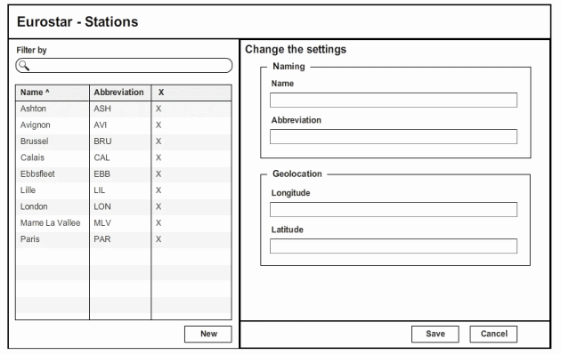
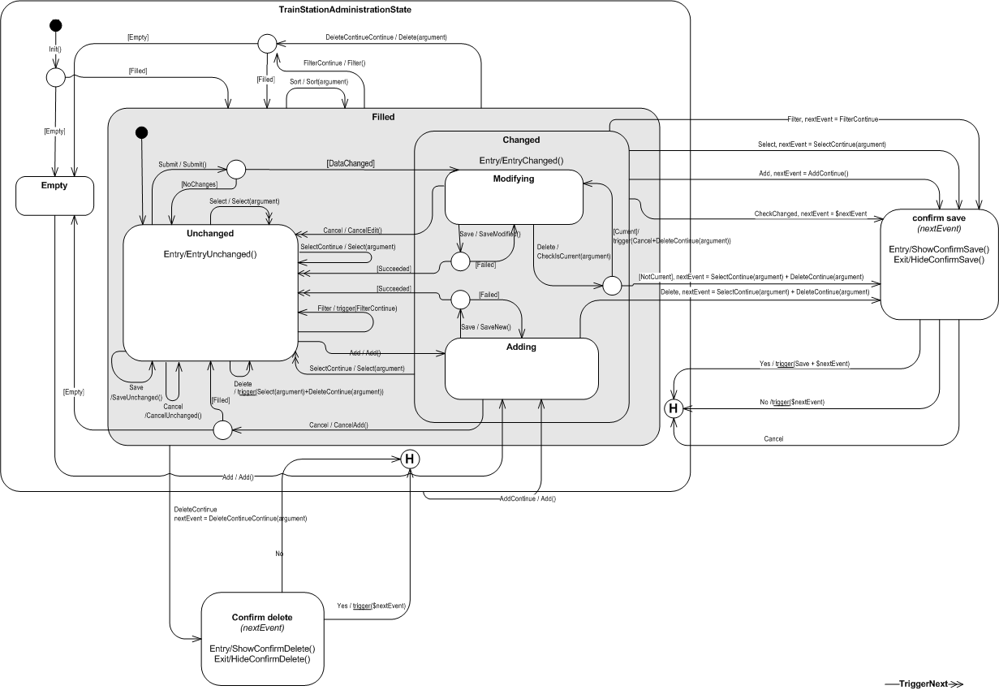

Let that sink in for a minute ... Raise your hand if you start out by designing a behavioral - not to be confused with a navigational - model of your UI before transforming those nice mock-ups into code. Yeah, I figured as much ;-). Why on earth would you want to turn user interface development into a software design technique? For the same reason all those XP engineering practices are so appealing: So that it can be changed repeatedly throughout the lifetime of the system. I think most of us know how fast UI code can become  'spaghetti'-shaped, despite our best effort to adhere to patterns like [MVC](http://en.wikipedia.org/wiki/Model%E2%80%93view%E2%80%93controller "Model View Controller"), [MVP](http://en.wikipedia.org/wiki/Model_View_Presenter "Model View Presenter"), [MVVM](http://en.wikipedia.org/wiki/MVVM "Model View ViewModel") et alii. We all aspire to have a UI that can be quickly and easily written, is easy to test using white box techniques, can be modified without introducing side-effects, and can be regression tested without manual labor. Yet, if we're honest, that's rarely what we end up with. I for one am a strong believer that using statechart notation for all but trivial User Interfaces is a must to get us there. It offers insight you can hardly get from looking at either a mockup or controller code.

### Example

Let's look at a simple master detail screen from which I've deliberately omitted things such as navigation and paging. It's a fictional "crud" screen used to edit [Eurostar](http://www.eurostar.com/ "Eurostar") train stations.  It's pretty easy to spot the behavior you have on this simple screen:

-   Filter: Filter the list of stations
-   Sort: Sort either one of the textual list columns
-   New: Start editing a station to add
-   Save: Save the station being modified or added
-   Cancel: Cancel the modification or addition of a station
-   Delete: Delete an existing station (the 'X' column above)
-   Select: Select a station to modify from the list

Coding each of these behaviors according to your pattern of choice is probably easy enough that I don't have to explain. Yet, what you'll end up with is:

1.  no abstract view of the software: you'll have to look at the code each time a question comes up about the behavior of the application.
2.  implicit contexts: you'll probably have conditional logic in your save event handler/controller action to determine whether a new train station is being added or an existing train station is modified. Granted, some patterns (and associated frameworks) will have pointed you in the right direction on this one, e.g. the webby ones might have turned these two contexts into two distinct urls. But take a better look at the above screen ... that's one screen, not two (which is the easy way out most people tend to take).
3.  software that is not working correctly: it depends on your skill as a developer to identify all possible ways a user can supply an event (behavior) to your application.

There are other points to consider like the resulting code being object oriented or easy to maintain. To me the first point is about design as a communication tool. The last two points are the most insidious, and here's why:

> When I'm adding a new station or editing an existing one, what happens when I press the "delete" button (X) of a station item in the list or when I press the "new" button or I select another station?

Again, you could disable every other trigger (button/link) on that screen while in "edit" mode just to prove me wrong. We could have a lengthy discussion on whether one is better than the other from a usability point of view. Suffice it to say that I consider disabling triggers to be the easy way out, so just indulge me here :). I'm not going to beat about the bush and just show you one possible resulting statechart for the behavior of this screen:  Taking the Filter behavior as an example, you'll get something along these lines (pseudo-code) in a traditional approach: 

```csharp
 //Called directly (when the Filter event is triggered) public void Filter() { if(WeAreInEditMode) { ShowConfirmSaveDialog(); return; } var stations = QueryStationsUsingFilter(); DisplayStationsInList(stations); } //Called after save confirmation public void Reload() { var stations = QueryStationsUsingFilter(); DisplayStationsInList(stations); SetEditMode(None); } 
```

 while in a statechart driven approach you'll get: 

```csharp
 //Called both directly and after save confirmation public FilterGuard Filter() { var stations = QueryStationsUsingFilter(); if(stations.Any()) { DisplayStationsInList(stations); return FilterGuard.Filled; } ClearStationsInList(); return FilterGuard.Empty; } 
```

 The main difference is that all the conditional logic in the first approach is inside your controller, while in the latter approach the statechart "runtime" takes care of tracking what is essentially context for you. The statechart "runtime" protects you from making illegal transitions and is in charge of the flow, alleviating your controllers from using conditional logic to determine what context they are in. Since the controller methods either return void or a guard value, it's obvious this is not your ASP.NET MVC variety of controller. The statechart "runtime" works best in conjunction with a front controller, POCO controllers and viewmodels that enable changetracking.

### Conclusion

This was just an introductionary post. There are a lot more details to discuss/describe. Maybe someday I'll muscle the enthusiasm to write about them. If you can't wait to learn more about this technique, then do read Ian Horrocks inspirational book.

### Credits

-   "Constructing the User Interface with Statecharts" by Ian Horrocks. Probably the most comprehensible work on the subject.
-   Professor David Harel, inventor of the graphical language of statecharts (<http://www.wisdom.weizmann.ac.il/~harel>).
-   Two ex-colleagues of mine who have been very influential in this space: [Philip Almey](http://www.linkedin.com/in/philipalmey "Philip Almey") and [Yoeri Van de Moortel](http://www.linkedin.com/in/yoerivdm).
-   http://www.w3.org/TR/scxml/ is a way to describe statechart using xml. I'm not particularly fond of how they've dealt with transitions but that's a rant for another post.
-   http://doc.qt.nokia.com/latest/statemachine-api.html

