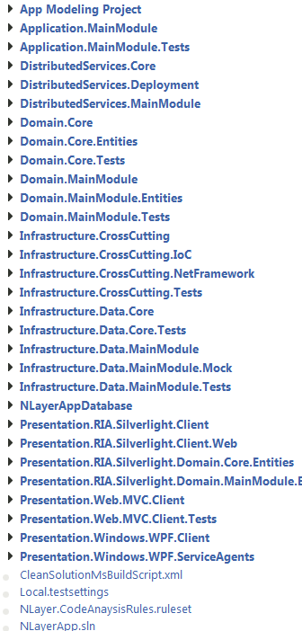

Most agile processes are about (shortening) feedback loops. They come in many shapes and sizes: red/green/refactor, burn down charts, continuous integration, ui mockups, quality assurance ... to name a few. One I recently rediscovered is the power of queries on a version control system.

> If history has taught me anything, it's that learning from the past is essential to understand the future better. A [GodFather](http://www.youtube.com/watch?v=4dWE_ag9W6o "The GodFather") inspired quote.

While VCS (version control system) statistics are not a new thing and countless tools exist to query the lines of code in a file, in general I find them to be just that ... too general. Nobody knows the specifics and structure of your working copy as well as you do (or maybe you don't if you got thrown into it, but that's another story).

> I'm using the term *working copy layout* to refer to the structure of code within a specific branch. The term *repository layout* usually refers to how your branches are structured. Keep this in mind while reading further.

Perhaps you've aligned your working copy layout - like so many have done before us - along the lines of layers or tiers of a project. \[caption id="attachment\_420" align="aligncenter" width="336" caption="Working Copy - Layered Layout"\]\[/caption\] Eventhough this is not the most flattering example in terms of working copy structure, it's already triggering a few questions I might want to ask.

-   Which parts are we working the most on (change the most)?
-   Any infrastructure we're changing all the time (due to bugs)?
-   How much time/effort are we spending on domain code vs infrastructure code?
-   Any big files in there we should be worried about (changing all the time)?
-   Any files in there that have a tendency to change together but cross boundaries (project/tier/layer)?
-   How are we committing (big/small changesets, frequency of commits)?
-   Are we committing changes all over the code base or in certain parts of it?
-   Does each commit bring a set of test files along with it?
-   ...

Needless to say, this list is endless. Both your working copy and VCS are a goldmine waiting to be exploited. The good news is that you don't need a whole lot of tooling to get started. Pretty much any language has an API that let's you deal with files and folders, so that should cover the working copy part. Most modern version control systems have several language bindings that allow you to automate them. And even if they don't, there's probably a command line tool you can invoke to get the data you want. So far I tried this out on Git, Mercurial and Subversion without any noticeable problems. If you want to do any meaningful analysis, you should - and I can't stress this enough - **start by figuring out which question(s) you want answered**. Some might be answered by merely exporting the log out of the VCS, others by scanning the files and folders in your working copy. The difficult ones - the ones that go beyond the file name/size into the file content - might require some script, regular expressions or language parsers to be able to tell you things such as how your code is changing (Michael Feathers has some [nice things](http://michaelfeathers.typepad.com/michael_feathers_blog/2011/09/temporal-correlation-of-class-changes.html "Temporal Correlation of Class Changes") to say about that). Still others might be answered by correlating log messages to your bug/issue/story tracking tool to certain clusters of code. For simple log related questions I found that [map/reduce](http://en.wikipedia.org/wiki/MapReduce "What is map reduce?") over a [canonical log model](http://en.wikipedia.org/wiki/Canonical_Model "What is a canonical model?") can do wonders.

> I've been able to perform the method-level analysis mentioned by [Michael Feathers](https://twitter.com/#!/mfeathers "Michael Feathers") - using [NRefactory](http://wiki.sharpdevelop.net/NRefactory.ashx "NRefactory") - to get an idea of how methods evolved in a C\# project over time. I'll explain that approach in an upcoming post.

I'll show you a brief example of how you can plot a correlation between changes to files and large files. The first query gives me an idea of the most changed files. It's using [SharpSvn](http://sharpsvn.open.collab.net/ "SharpSvn project") to get at each revision. You could use [Mercurial.NET](http://mercurialnet.codeplex.com/ "Mercurial.NET project") or [libgit2sharp](https://github.com/libgit2/libgit2sharp "LibGit2Sharp repository") to obtain similar results in Mercurial or Git. 

```csharp
 from mapped in (from log in logs from path in log.ChangedPaths where path.Action == SvnChangeAction.Add || path.Action == SvnChangeAction.Modify || path.Action == SvnChangeAction.Replace select new { Path = path.RepositoryPath, CommitCount = 1 }) group mapped by mapped.Path into reduced select new MostChangedPath { RepositoryPath = reduced.Key, CommitCount = reduced.Sum(i =&gt; i.CommitCount) }; 
```

 Next up is a query that gives me an idea of the line count on a file by file basis. The GetFiles function recursively iterates all files in a working copy that match a given search pattern regular expression (to match multiple files). 

```csharp
 GetFiles(workingCopyPath, GetSearchPatternExpression(), SearchOption.AllDirectories). Select(filePath =&gt; new FileLineCount { FilePath = filePath, LineCount = File.ReadAllLines(filePath).Length }); 
```

 Combined with some charting and unleashed on the .cs files of the popular [Json.NET library](http://json.codeplex.com/ "Json.NET"), you'll get something that resembles the diagram below. Yeah, it's gonna take some zooming ...  Files you don't have control over should be excluded (or replaced by something lighter if relevant) from the analysis. Big files that change slowly, only become a priority when you've dealt with big and smaller files that change frequently (in that order).

#### Conclusion

Basically all this log and repository analysis revolves around very simple recipes. Get the log entries, run some map/reduce queries over them, evaluate the results. If the metric doesn't buy you much, try another query. Some VCS are slow with regard to feeding your code the log entries, so you might benefit from caching them in a canonical format on disk or in some map/reduce optimized *database* system. If you're using a VCS that is "slow" or "difficult" to work with in this setting, you may want to convert your repository - for analysis purposes only ([TFS](http://en.wikipedia.org/wiki/Team_Foundation_Server "Team Foundation Systems") comes to mind) - to a VCS that is more suitable. As usual, I've only scratched the surface of what is possible. People working with legacy code will surely appreciate this *new* tool in their box and put it to good use. So, please, do try this at home and at work :-). I'm looking forward to hearing back from you. Without wanting to sound patronizing, I do have a few remarks:

-   Don't use this to blame, the why & what are far more important than the who.
-   Do watch out for false positives, digg for the reasons, and if they're just, leave it at that.
-   This is not a "silver bullet" and is best mixed with other static code analysis tools and forms of feedback.

